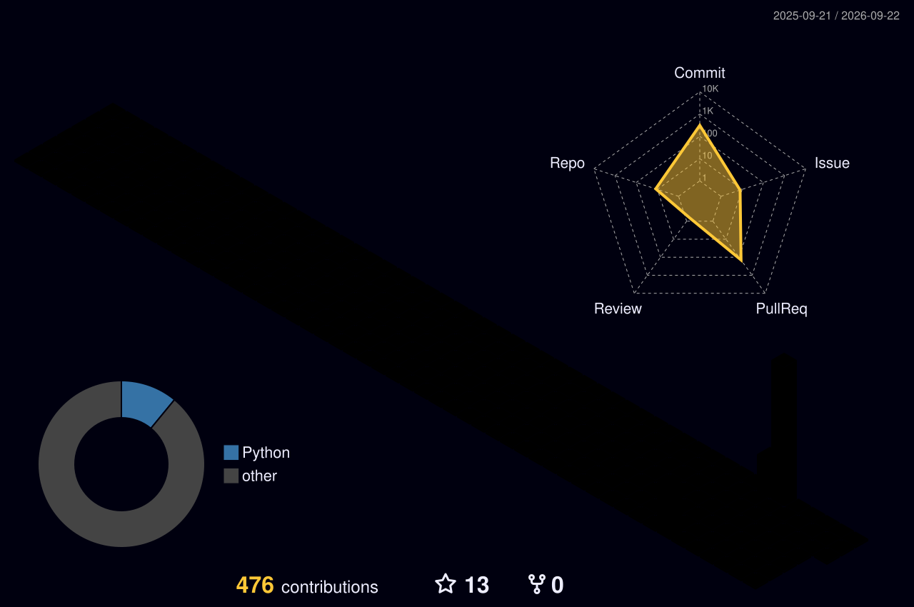

<div align="center">

<!-- Hero Banner -->


<!-- Animated Typist -->
<a href="https://github.com/mrzroot">
  
</a>

<br />

<!-- Live Status Badges -->
<p align="center">
  
  
  
  
</p>

</div>

---

### 💻 Engineering Profile & Core Philosophy

```python
class SeniorEngineer:
    def __init__(self):
        self.name = "M-R-Z"
        self.handle = "mrzroot"
        self.specialization = "Backend Systems, Enterprise Data Governance & ETL"
        self.design_principles = [
            "YAGNI & Ponytail Minimalist Architecture (Minimum code that works)",
            "Zero-Tolerance for Architectural Bloat & Premature Optimization",
            "High-Throughput Concurrency & Strict Data Integrity",
            "Automated CI/CD Workflows & Declarative Infrastructure"
        ]
        self.signature_deliverables = [
            "Unified 9 Enterprise Systems & 13 Databases into DBML / OpenAPI 3.0",
            "Custom Silent Local Hardware Printing Agent (PrintBridge)",
            "Automated Multi-Branch Jenkins CI/CD Groovy Pipelines"
        ]

    def build_system(self, domain: str) -> str:
        return f"Scalable, resilient, and elegant {domain} engineered with mathematical precision."
```

---

### 🛠️ Technical Arsenal & Core Competencies

<div align="center">

| Domain | Technologies & Frameworks |
| :--- | :--- |
| **Backend & Core** |  |
| **Databases & Storage** |  |
| **DevOps, CI/CD & Infra** |  |
| **Tools & Architecture** |  |

</div>

<br />

<p align="center">
  
</p>

---

### 🌟 Featured Engineering Projects

<table>
  <tr>
    <td width="50%">
      <h3 align="center">🏛️ Enterprise Data Governance</h3>
      <p align="center">
        
        
      </p>
      <p>Unification of 9 enterprise systems and 13 databases (MySQL & SQL Server) into a 360-degree data governance architecture with automated ETL, DBML diagrams, and OpenAPI web-services.</p>
    </td>
    <td width="50%">
      <h3 align="center">🖨️ <a href="https://github.com/mrzroot/printbridge">PrintBridge</a></h3>
      <p align="center">
        
        
      </p>
      <p>Silent, high-speed local printing daemon bridging modern web applications directly to thermal POS and document printers without browser dialog delays.</p>
    </td>
  </tr>
  <tr>
    <td width="50%">
      <h3 align="center">🌐 <a href="https://github.com/mrzroot/awesome-persian-developer-resources">Awesome Persian Developer Resources</a></h3>
      <p align="center">
        
        
      </p>
      <p>A flagship curated collection of tools, libraries, architectural blueprints, and essential documentation for Persian-speaking software engineers worldwide.</p>
    </td>
    <td width="50%">
      <h3 align="center">⚡ <a href="https://github.com/mrzroot/jenkins">Jenkins Pipeline Master</a></h3>
      <p align="center">
        
        
      </p>
      <p>Production-grade declarative Jenkins pipelines demonstrating automated testing, containerized builds, artifact archival, and multi-environment delivery.</p>
    </td>
  </tr>
</table>

---

### 📈 Real-Time GitHub Intelligence & Metrics

<p align="center">
  
  
  
  
</p>

---

### 🧊 3D Isometric Contribution Graph

<div align="center">
  <picture>
    <source media="(prefers-color-scheme: dark)" srcset="profile-3d-contrib/profile-night-rainbow.svg" />
    <source media="(prefers-color-scheme: light)" srcset="profile-3d-contrib/profile-green-animate.svg" />
    
  </picture>
</div>

---

### 📬 Connect & Collaborate

<div align="center">

<a href="https://github.com/mrzroot">
  
</a>
<a href="mailto:contact@mrzroot.dev">
  
</a>
<a href="https://linkedin.com/in/mrzroot">
  
</a>
<a href="https://t.me/mrzroot">
  
</a>

<br /><br />

<sub>⚡ Crafted with precision & minimal code · <b>M-R-Z</b> · Let's engineer scalable systems together.</sub>

</div>
