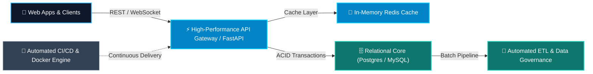

<div align="center">

<!-- Hero Banner -->


<!-- Animated Typist -->
<a href="https://github.com/mrzroot">
  
</a>

<br />

<!-- Live Status Badges -->
<p align="center">
  
  
  
  
  
</p>

</div>

---

### 💻 About Me & What I Build

```python
class Developer:
    def __init__(self):
        self.name = "M-R-Z"
        self.handle = "mrzroot"
        self.interests = ["Python Automation", "Backend APIs", "Open Source Tools"]
        self.learning_mindset = [
            "Building practical tools that solve everyday problems",
            "Writing clean, readable, and simple code (Less is more)",
            "Continuous learning and sharing with the developer community"
        ]

    def current_mission(self) -> str:
        return "Creating lightweight, easy-to-use Python tools for developers!"
```

---

### 📐 Signature System Architecture & Flow



---

### 🛠️ Tech Stack & Tools

<p align="center">
  
</p>

---

### 🌟 Featured Engineering Projects

<table>
  <tr>
    <td width="50%">
      <h3 align="center">🌐 <a href="https://github.com/mrzroot/awesome-persian-developer-resources">Awesome Persian Dev Resources</a></h3>
      <p align="center">
        
        
      </p>
      <p>Curated flagship collection of anti-sanction DNS tools, free Iranian public APIs, fonts, Python/Backend packages, and AI/NLP models for developers.</p>
    </td>
    <td width="50%">
      <h3 align="center">⚡ <a href="https://github.com/mrzroot/universal-video-downloader">Universal Video Downloader</a></h3>
      <p align="center">
        
        
      </p>
      <p>High-speed Chrome/Edge browser extension to sniff, extract, and download live video streams, m3u8 playlists, and MP4 media with zero watermark.</p>
    </td>
  </tr>
  <tr>
    <td width="50%">
      <h3 align="center">🖨️ <a href="https://github.com/mrzroot/printbridge">PrintBridge</a></h3>
      <p align="center">
        
        
      </p>
      <p>Silent, high-speed local printing daemon bridging modern web applications directly to thermal POS and document printers without browser dialog delays.</p>
    </td>
    <td width="50%">
      <h3 align="center">⚡ <a href="https://github.com/mrzroot/jenkins">Jenkins Pipeline Master</a></h3>
      <p align="center">
        
        
      </p>
      <p>Production-grade declarative Jenkins pipelines demonstrating automated testing, containerized builds, artifact archival, and multi-environment delivery.</p>
    </td>
  </tr>
  <tr>
    <td colspan="2" align="center">
      <h3>🏛️ Enterprise Data Governance & 360° Architecture (MCCIMA)</h3>
      <p>
        
        
        
      </p>
      <p>Enterprise data unification framework transforming 9 disparate systems and 13 databases into unified DBML models, OpenAPI standard web services, and automated ETL pipelines.</p>
    </td>
  </tr>
</table>

---

### 📈 Real-Time GitHub Intelligence & Metrics

<p align="center">
  
  
  
  
</p>


---

### 📬 Connect & Collaborate

<div align="center">

<a href="https://github.com/mrzroot">
  
</a>
<a href="mailto:contact@mrzroot.dev">
  
</a>
<a href="https://linkedin.com/in/mrzroot">
  
</a>
<a href="https://t.me/mrzroot">
  
</a>

<br /><br />

<sub>⚡ Crafted with precision & minimal code · <b>M-R-Z</b> · Let's engineer scalable systems together.</sub>

</div>
