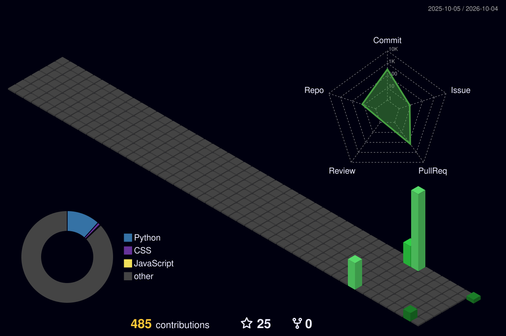

<a href="https://mrzroot.github.io/">
  <picture>
    <source media="(prefers-color-scheme: dark)" srcset="./assets/header-dark.svg">
    <source media="(prefers-color-scheme: light)" srcset="./assets/header-light.svg">
    
  </picture>
</a>

  
  
  

### Hi, I'm Mohammadreza Zare (M-R-Z)

I'm a Python developer in Mashhad, Iran. I work where automation meets the backend: scripts that remove repetitive tasks, small services and APIs, and the tooling that keeps them running. My recent work spans a Persian text linter, a network doctor for developers in Iran, a self-hosted workflow engine, a release mirroring tool for domestic hosts, a local emulator for Iranian payment and SMS APIs, browser extensions and CI pipelines.

How I work: solve the real problem, keep the code small and readable, and make setup take minutes, not hours.

**→ See my work and get in touch at [mrzroot.github.io](https://mrzroot.github.io/)** (also in [Persian](https://mrzroot.github.io/?lang=fa)).

### Featured projects

Every project has its own website (live demo, features, quick start, FAQ) in English and Persian: **[all projects](https://mrzroot.github.io/projects/)**.

**Flagship tools** · each with a release, CI and a product page

<table>
  <tr>
    <td width="33%" valign="top">
      <a href="https://github.com/mrzroot/paknevis"><b>paknevis · پاک‌نویس</b></a> 
      Python · CLI · pre-commit · GitHub Action  
      A Persian text linter and auto-fixer, like Prettier/ESLint for Persian writing: ZWNJ (half-space), Arabic characters, punctuation and digits, with 25 rules. It never touches code, URLs, markup or math in Markdown, HTML and LaTeX.  
      <a href="https://mrzroot.github.io/paknevis/">Website &amp; playground</a> · <a href="https://github.com/mrzroot/paknevis">Repository</a> · <a href="https://github.com/mrzroot/paknevis/releases/latest">Release</a>
    </td>
    <td width="33%" valign="top">
      <a href="https://github.com/mrzroot/netdoctor-ir"><b>netdoctor-ir</b></a> 
      Python · asyncio · dnspython · Textual  
      A connectivity doctor and mirror switcher for developers in Iran. It scans 38 developer services for filtering and sanctions, ranks 13 DNS resolvers, and tests and configures 37 PyPI, npm, Docker, Go and Maven mirrors, with backups and restore.  
      <a href="https://mrzroot.github.io/netdoctor-ir/">Website</a> · <a href="https://github.com/mrzroot/netdoctor-ir">Repository</a> · <a href="https://github.com/mrzroot/netdoctor-ir/releases/latest">Release</a>
    </td>
    <td width="33%" valign="top">
      <a href="https://github.com/mrzroot/flowpilot"><b>flowpilot</b></a> 
      Python · FastAPI · SQLite · Telegram  
      A self-hosted, code-first workflow automation engine (a tiny n8n in a Git repo): YAML workflows, cron, webhook, file and RSS triggers, Telegram-first steps, a live dashboard, plugins and Jalali date filters.  
      <a href="https://mrzroot.github.io/flowpilot/">Website</a> · <a href="https://github.com/mrzroot/flowpilot">Repository</a> · <a href="https://github.com/mrzroot/flowpilot/releases/latest">Release</a>
    </td>
  </tr>
  <tr>
    <td width="33%" valign="top">
      <a href="https://github.com/mrzroot/dokhaneh"><b>dokhaneh · دوخانه</b></a> 
      Python · Typer · boto3 · PyNaCl · GitHub Action  
      Publishes every release to GitHub and Iranian domestic hosts (ArvanCloud, Liara, Gitea) in one step, with an Ed25519-signed manifest, a fallback install.sh that verifies signatures and hashes, and status/verify commands.  
      <a href="https://mrzroot.github.io/dokhaneh/">Website</a> · <a href="https://github.com/mrzroot/dokhaneh">Repository</a> · <a href="https://github.com/mrzroot/dokhaneh/releases/latest">Release</a>
    </td>
    <td width="33%" valign="top">
      <a href="https://github.com/mrzroot/mihanstack"><b>MihanStack · میهن‌استک</b></a> 
      TypeScript · Node.js · Docker · GitHub Action  
      The local development cloud for Iranian services: emulates Zarinpal, Zibal, Kavenegar and SMS.ir with switchable failure scenarios, chaos mode, a webhook playground, record/replay with redaction and an RTL-aware dashboard.  
      <a href="https://mrzroot.github.io/mihanstack/">Website</a> · <a href="https://github.com/mrzroot/mihanstack">Repository</a> · <a href="https://github.com/mrzroot/mihanstack/releases/latest">Release</a>
    </td>
    <td width="33%" valign="top">
      <a href="https://mrzroot.github.io/projects/"><b>All projects →</b></a>  
      Features, install steps and quick starts for every project, in English and Persian.
    </td>
  </tr>
</table>

**More projects**

<table>
  <tr>
    <td width="50%" valign="top">
      <a href="https://github.com/mrzroot/agentforge"><b>AgentForge</b></a> · TypeScript · Node.js 
      Keeps one source of AI coding-agent rules in sync across tools (Cursor, Claude Code, Windsurf, Copilot, Roo, Aider), compresses code context with AST analysis, and lints rules for security issues and conflicts. 
      <a href="https://mrzroot.github.io/agentforge/">Website</a> · <a href="https://github.com/mrzroot/agentforge">Repository</a>
    </td>
    <td width="50%" valign="top">
      <a href="https://github.com/mrzroot/awesome-persian-developer-resources"><b>Awesome Persian Developer Resources</b></a> · Curated list 
      One categorized hub for tools Iranian developers rely on: anti-sanction DNS and tools, free Iranian APIs, Persian fonts, Python packages and AI/NLP resources. 
      <a href="https://mrzroot.github.io/awesome-persian-developer-resources/">Website</a> · <a href="https://github.com/mrzroot/awesome-persian-developer-resources">Repository</a>
    </td>
  </tr>
  <tr>
    <td width="50%" valign="top">
      <a href="https://github.com/mrzroot/universal-video-downloader"><b>Universal Video Downloader</b></a> · JavaScript · Manifest V3 
      A Chrome and Edge extension that detects HLS (M3U8) and MP4 streams on a page and saves them, entirely client-side. 
      <a href="https://mrzroot.github.io/universal-video-downloader/">Website</a> · <a href="https://github.com/mrzroot/universal-video-downloader">Repository</a>
    </td>
    <td width="50%" valign="top">
      <a href="https://github.com/mrzroot/page-smash"><b>Page Smash</b></a> · JavaScript · browser extension 
      An original physics toy for Chrome, Edge and Firefox: fly a jetpack character over any webpage and smash its text and images apart. 
      <a href="https://mrzroot.github.io/page-smash/">Website</a> · <a href="https://github.com/mrzroot/page-smash">Repository</a>
    </td>
  </tr>
  <tr>
    <td width="50%" valign="top">
      <a href="https://github.com/mrzroot/jenkins"><b>Jenkins Pipeline Examples</b></a> · Groovy · Jenkinsfile 
      Small, readable declarative Jenkins pipelines with staged builds, plus a variant with SCM polling. 
      <a href="https://mrzroot.github.io/jenkins/">Website</a> · <a href="https://github.com/mrzroot/jenkins">Repository</a>
    </td>
    <td width="50%" valign="top">
      <a href="https://github.com/mrzroot/printbridge"><b>PrintBridge</b></a> · Fork of <a href="https://github.com/AnouarSbia/printbridge">AnouarSbia/printbridge</a> 
      A local agent that takes print jobs from web apps and prints PDFs and thermal labels without a dialog. Forked from AnouarSbia's original project; credit to the original author.
    </td>
  </tr>
</table>

### Tech stack

| Area | Tools |
| --- | --- |
| Core & backend | Python · Django · Flask · FastAPI · PHP / Laravel · REST & WebSocket |
| Data | PostgreSQL · MySQL · SQLite · Redis · SQL |
| Web & browser | TypeScript · JavaScript · Node.js · React · Vue · Chrome extensions (MV3) |
| Ops & tooling | Git & GitHub · Jenkins · Docker · Cursor · Claude Code · Copilot |

### Activity

<picture>
  <source media="(prefers-color-scheme: dark)" srcset="./profile-3d-contrib/profile-night-green.svg">
  <source media="(prefers-color-scheme: light)" srcset="./profile-3d-contrib/profile-green.svg">
  
</picture>

Generated daily in this repository by <a href="https://github.com/yoshi389111/github-profile-3d-contrib">github-profile-3d-contrib</a>.

### Get in touch

The fastest way to reach me is **Telegram: [@mrzroot](https://t.me/mrzroot)**. You can also find me on [LinkedIn](https://linkedin.com/in/mrzroot), or open an issue on any of my repositories here on GitHub.
