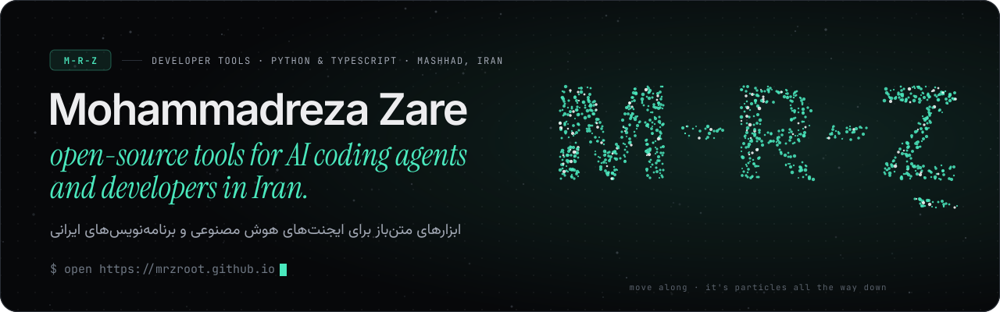
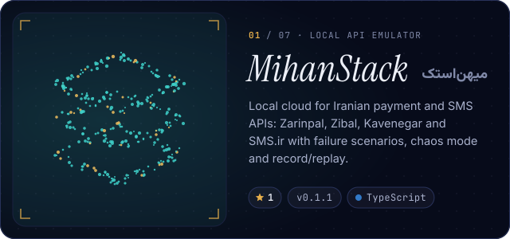
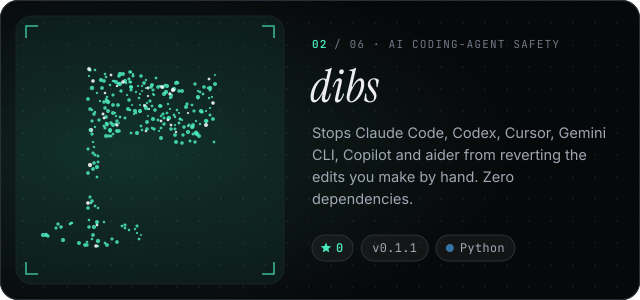
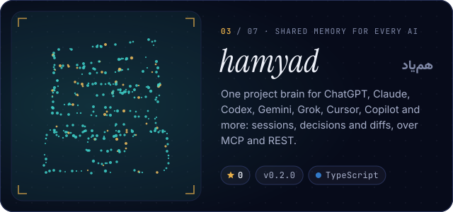
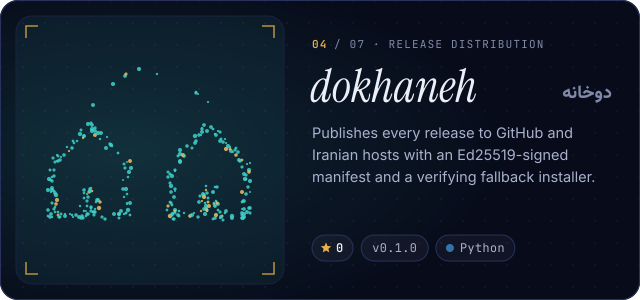
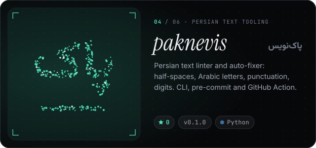
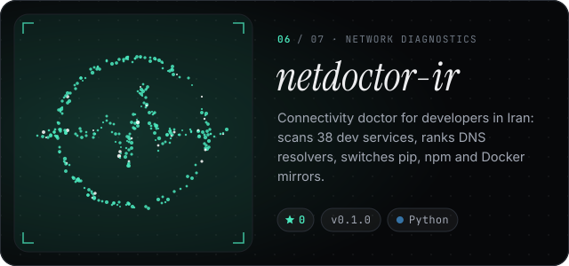
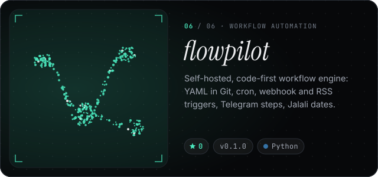
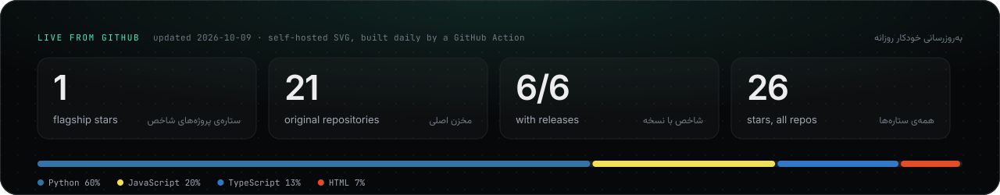
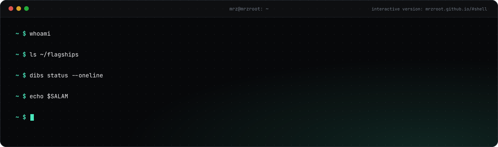

<a href="https://mrzroot.github.io/">
  <picture>
    <source media="(prefers-color-scheme: dark)" srcset="./assets/gen/header-dark.svg">
    <source media="(prefers-color-scheme: light)" srcset="./assets/gen/header-light.svg">
    
  </picture>
</a>

  <a href="https://mrzroot.github.io/"><b>mrzroot.github.io</b></a> ·
  <a href="https://mrzroot.github.io/?lang=fa">فارسی</a> ·
  <a href="https://t.me/mrzroot">Telegram</a> ·
  <a href="https://linkedin.com/in/mrzroot">LinkedIn</a>

I build **open-source developer tools** in Python and TypeScript, mostly for **AI coding agents** and for **developers in Iran**. Small, well-tested tools, each with a release, docs and its own website.

ابزارهای متن‌باز توسعه می‌دهم، بیشتر برای <b>ایجنت‌های کدنویسی هوش مصنوعی</b> و <b>برنامه‌نویس‌های ایرانی</b>؛ ابزارهای کوچک و تست‌شده، هر کدام با نسخهٔ منتشرشده، مستندات و وب‌سایت.

### Flagship projects

<a href="https://github.com/mrzroot/mihanstack"><picture><source media="(prefers-color-scheme: dark)" srcset="./assets/gen/card-mihanstack-dark.svg"><source media="(prefers-color-scheme: light)" srcset="./assets/gen/card-mihanstack-light.svg"></picture></a>
<a href="https://github.com/mrzroot/dibs"><picture><source media="(prefers-color-scheme: dark)" srcset="./assets/gen/card-dibs-dark.svg"><source media="(prefers-color-scheme: light)" srcset="./assets/gen/card-dibs-light.svg"></picture></a>
<a href="https://github.com/mrzroot/hamyad"><picture><source media="(prefers-color-scheme: dark)" srcset="./assets/gen/card-hamyad-dark.svg"><source media="(prefers-color-scheme: light)" srcset="./assets/gen/card-hamyad-light.svg"></picture></a>
<a href="https://github.com/mrzroot/dokhaneh"><picture><source media="(prefers-color-scheme: dark)" srcset="./assets/gen/card-dokhaneh-dark.svg"><source media="(prefers-color-scheme: light)" srcset="./assets/gen/card-dokhaneh-light.svg"></picture></a>
<a href="https://github.com/mrzroot/paknevis"><picture><source media="(prefers-color-scheme: dark)" srcset="./assets/gen/card-paknevis-dark.svg"><source media="(prefers-color-scheme: light)" srcset="./assets/gen/card-paknevis-light.svg"></picture></a>
<a href="https://github.com/mrzroot/netdoctor-ir"><picture><source media="(prefers-color-scheme: dark)" srcset="./assets/gen/card-netdoctor-ir-dark.svg"><source media="(prefers-color-scheme: light)" srcset="./assets/gen/card-netdoctor-ir-light.svg"></picture></a>
<a href="https://github.com/mrzroot/flowpilot"><picture><source media="(prefers-color-scheme: dark)" srcset="./assets/gen/card-flowpilot-dark.svg"><source media="(prefers-color-scheme: light)" srcset="./assets/gen/card-flowpilot-light.svg"></picture></a>

Want to contribute? Every flagship has issues labelled <a href="https://github.com/search?q=user%3Amrzroot+label%3A%22good+first+issue%22+state%3Aopen&type=issues"><b>good first issue</b></a>.

### Live from GitHub

<picture>
  <source media="(prefers-color-scheme: dark)" srcset="./assets/gen/stats-dark.svg">
  <source media="(prefers-color-scheme: light)" srcset="./assets/gen/stats-light.svg">
  
</picture>

<picture>
  <source media="(prefers-color-scheme: dark)" srcset="./assets/gen/terminal-dark.svg">
  <source media="(prefers-color-scheme: light)" srcset="./assets/gen/terminal-light.svg">
  
</picture>

<picture>
  <source media="(prefers-color-scheme: dark)" srcset="https://raw.githubusercontent.com/mrzroot/mrzroot/output/snake-turquoise-dark.svg">
  <source media="(prefers-color-scheme: light)" srcset="https://raw.githubusercontent.com/mrzroot/mrzroot/output/snake-turquoise-light.svg">
  
</picture>

<b>More projects</b>

- [**AgentForge**](https://github.com/mrzroot/agentforge) · one source of AI coding-agent rules, synced to Cursor, Claude Code, Windsurf, Copilot, Roo and Aider.
- [**Awesome Persian Developer Resources**](https://github.com/mrzroot/awesome-persian-developer-resources) · curated hub of tools Iranian developers rely on.
- [**Universal Video Downloader**](https://github.com/mrzroot/universal-video-downloader) · Chrome/Edge extension that saves HLS and MP4 streams, client-side.
- [**Page Smash**](https://github.com/mrzroot/page-smash) · jetpack physics toy that smashes any webpage.
- [**Jenkins Pipeline Examples**](https://github.com/mrzroot/jenkins) · small, readable declarative pipelines.
- [**PrintBridge**](https://github.com/mrzroot/printbridge) · fork of [AnouarSbia/printbridge](https://github.com/AnouarSbia/printbridge), a local agent for silent PDF and label printing.

Cards, stats and terminal are self-hosted SVGs, rebuilt daily by <a href="./.github/workflows/profile-cards.yml">a GitHub Action</a> from <a href="./scripts/build_profile.py">scripts/build_profile.py</a>. Text is outlined with HarfBuzz, so Persian renders the same everywhere.
