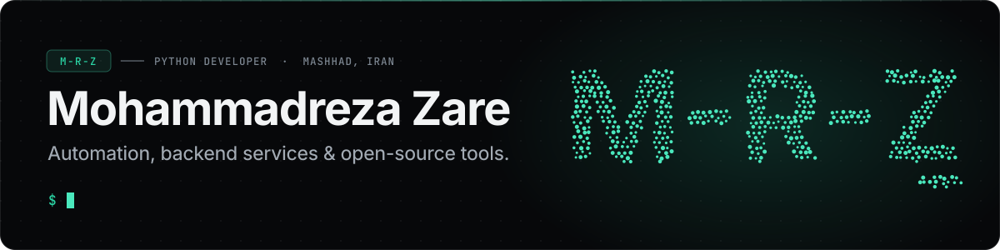

<a href="https://mrzroot.github.io/">
  <picture>
    <source media="(prefers-color-scheme: dark)" srcset="./assets/header-dark.svg">
    <source media="(prefers-color-scheme: light)" srcset="./assets/header-light.svg">
    
  </picture>
</a>

  
  
  

### Mohammadreza Zare (M-R-Z)

I build open-source developer tools in Python and TypeScript, mostly for **AI coding agents** and for **developers in Iran**. Small, well-tested tools with releases, docs and a website each. Based in Mashhad, Iran.

**[mrzroot.github.io](https://mrzroot.github.io/)** · [فارسی](https://mrzroot.github.io/?lang=fa) · Telegram [@mrzroot](https://t.me/mrzroot)

### Flagship projects

| Project | What it does | Status |
| --- | --- | --- |
| **[MihanStack · میهن‌استک](https://github.com/mrzroot/mihanstack)**  TypeScript · [website](https://mrzroot.github.io/mihanstack/) | Local cloud for Iranian payment and SMS APIs: emulates Zarinpal, Zibal, Kavenegar and SMS.ir with failure scenarios, chaos mode, webhooks and record/replay. |    |
| **[dibs](https://github.com/mrzroot/dibs)**  Python · [website](https://mrzroot.github.io/dibs/) | Stops AI coding agents (Claude Code, Codex, Cursor, Gemini CLI, Copilot, aider) from reverting your hand edits. Zero dependencies. |    |
| **[dokhaneh · دوخانه](https://github.com/mrzroot/dokhaneh)**  Python · [website](https://mrzroot.github.io/dokhaneh/) | Publishes each release to GitHub and Iranian hosts (ArvanCloud, Liara, Gitea) with an Ed25519-signed manifest and a verifying install.sh. |    |
| **[paknevis · پاک‌نویس](https://github.com/mrzroot/paknevis)**  Python · [website](https://mrzroot.github.io/paknevis/) | Persian text linter and fixer (ZWNJ, Arabic letters, punctuation, digits) for Markdown, HTML and LaTeX. CLI, pre-commit and GitHub Action. |    |
| **[netdoctor-ir](https://github.com/mrzroot/netdoctor-ir)**  Python · [website](https://mrzroot.github.io/netdoctor-ir/) | Connectivity doctor for developers in Iran: checks 38 dev services, ranks DNS resolvers and switches PyPI, npm, Docker, Go and Maven mirrors. |    |
| **[flowpilot](https://github.com/mrzroot/flowpilot)**  Python · [website](https://mrzroot.github.io/flowpilot/) | Self-hosted, code-first workflow automation: YAML workflows, cron/webhook/RSS triggers, Telegram steps, dashboard and Jalali dates. |    |

Want to help? Each repo has issues labelled [**good first issue**](https://github.com/search?q=user%3Amrzroot+label%3A%22good+first+issue%22+state%3Aopen&type=issues).

### More projects

<table>
  <tr>
    <td width="50%" valign="top">
      <a href="https://github.com/mrzroot/agentforge"><b>AgentForge</b></a> · TypeScript · Node.js 
      Keeps one source of AI coding-agent rules in sync across tools (Cursor, Claude Code, Windsurf, Copilot, Roo, Aider), compresses code context with AST analysis, and lints rules for security issues and conflicts. 
      <a href="https://mrzroot.github.io/agentforge/">Website</a> · <a href="https://github.com/mrzroot/agentforge">Repository</a>
    </td>
    <td width="50%" valign="top">
      <a href="https://github.com/mrzroot/awesome-persian-developer-resources"><b>Awesome Persian Developer Resources</b></a> · Curated list 
      One categorized hub for tools Iranian developers rely on: anti-sanction DNS and tools, free Iranian APIs, Persian fonts, Python packages and AI/NLP resources. 
      <a href="https://mrzroot.github.io/awesome-persian-developer-resources/">Website</a> · <a href="https://github.com/mrzroot/awesome-persian-developer-resources">Repository</a>
    </td>
  </tr>
  <tr>
    <td width="50%" valign="top">
      <a href="https://github.com/mrzroot/universal-video-downloader"><b>Universal Video Downloader</b></a> · JavaScript · Manifest V3 
      A Chrome and Edge extension that detects HLS (M3U8) and MP4 streams on a page and saves them, entirely client-side. 
      <a href="https://mrzroot.github.io/universal-video-downloader/">Website</a> · <a href="https://github.com/mrzroot/universal-video-downloader">Repository</a>
    </td>
    <td width="50%" valign="top">
      <a href="https://github.com/mrzroot/page-smash"><b>Page Smash</b></a> · JavaScript · browser extension 
      An original physics toy for Chrome, Edge and Firefox: fly a jetpack character over any webpage and smash its text and images apart. 
      <a href="https://mrzroot.github.io/page-smash/">Website</a> · <a href="https://github.com/mrzroot/page-smash">Repository</a>
    </td>
  </tr>
  <tr>
    <td width="50%" valign="top">
      <a href="https://github.com/mrzroot/jenkins"><b>Jenkins Pipeline Examples</b></a> · Groovy · Jenkinsfile 
      Small, readable declarative Jenkins pipelines with staged builds, plus a variant with SCM polling. 
      <a href="https://mrzroot.github.io/jenkins/">Website</a> · <a href="https://github.com/mrzroot/jenkins">Repository</a>
    </td>
    <td width="50%" valign="top">
      <a href="https://github.com/mrzroot/printbridge"><b>PrintBridge</b></a> · Fork of <a href="https://github.com/AnouarSbia/printbridge">AnouarSbia/printbridge</a> 
      A local agent that takes print jobs from web apps and prints PDFs and thermal labels without a dialog. Forked from AnouarSbia's original project; credit to the original author.
    </td>
  </tr>
</table>

### Tech stack

Python (FastAPI, Django, Flask) · TypeScript / Node.js · PHP / Laravel · PostgreSQL, SQLite, Redis · Docker · GitHub Actions · Jenkins

### Contact

Telegram **[@mrzroot](https://t.me/mrzroot)** (fastest) · [LinkedIn](https://linkedin.com/in/mrzroot) · or open an issue on any repo.
